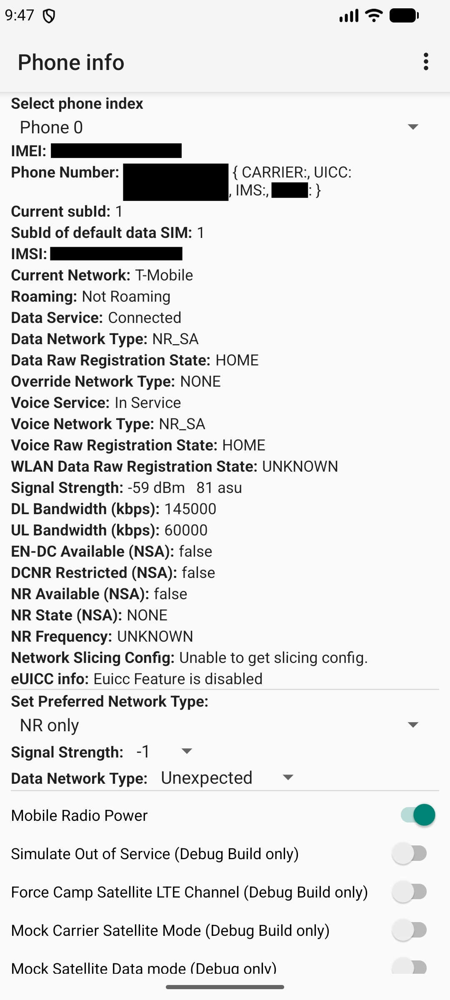
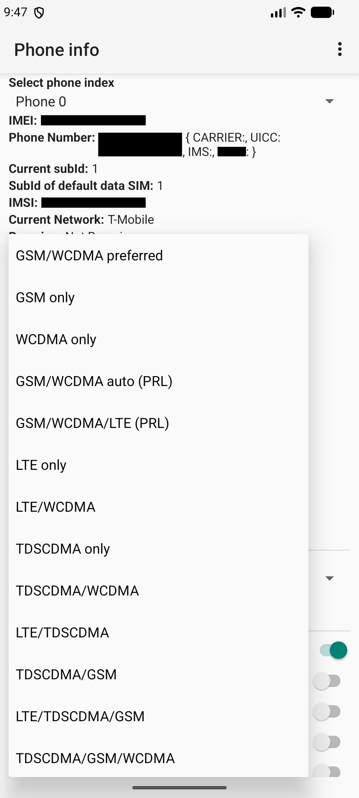
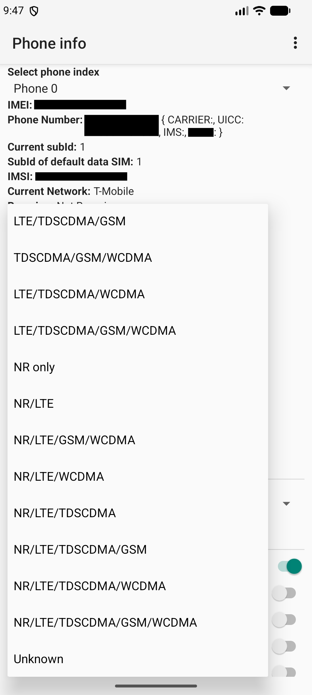

## Radio-Info

A small Android app to quickly open the hidden RadioInfo Activity.\
User can select their own networks like NR only , LTE only etc

## Features

- Direct Launch RadioInfo Activity
- No Permission Required
- Fully Offline
- No Advertisements

## Screenshots
<table align="center">
  <tr>
    <td align="center"></td>
    <td align="center"></td>
    <td align="left"></td>
  </tr>
  <tr>
    <td align="center"><b>Screenshots from Android 17</b></td>
  </tr>
</table>

## Android Versions
This App calls the below activity based on the Android versions.

Android 11 and above:  
`com.android.phone.settings.RadioInfo`

Below Android 11:  
`com.android.settings.RadioInfo`

The app checks the Android version and opens the correct RadioInfo activity.

## Why this app exists

I used to use App like - **Force LTE/NR** from Play Store quite often, mostly to change network mode and set it to 5G Only.\
But they had , ads and notifications which I didn't really need and made my experience worse!.

So I made this app just for myself to have same functionality with :- 

- No ads.  
- No notifications.  
- No complicated interface.

Just a small app that does one thing.

Open → RadioInfo → Done.

## Note

- RadioInfo is a hidden/system activity, so it may not work on every phone. It depends on the Android version, device manufacturer and ROM.
- Phone Calls may not work properly , If Network is Locked to NR.
